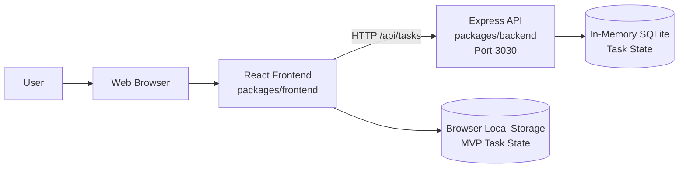
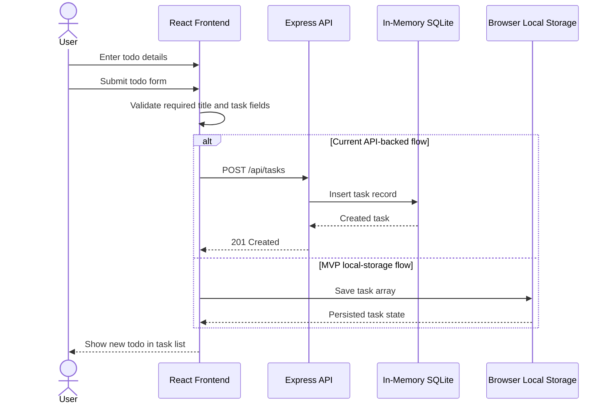

# Cloud Architecture Overview

This project is a TODO application monorepo with a React frontend, an Express API, and in-memory task state for the current backend implementation. The MVP requirements also call for browser local storage so task data can persist without backend or external storage.

## System Context

## Create Todo Flow

## Components

- Epic: Frontend Application
  - Story: React app renders the TODO experience from `packages/frontend`.
  - Story: Frontend calls `/api/tasks` for the current backend-backed task flow.
  - Story: MVP task state should persist to browser local storage.
- Epic: API Application
  - Story: Express API serves task endpoints from `packages/backend`.
  - Story: API listens on port `3030` by default.
  - Story: API currently stores task data in an in-memory SQLite database.
- Epic: Memory State
  - Story: In-memory SQLite state exists only while the backend process is running.
  - Story: Browser local storage is the MVP persistence target for user task data.

## Data Flow

- User actions happen in the browser through the React frontend.
- The current implementation sends task create, read, update, complete, and delete requests to the Express API.
- The Express API reads and writes task records in an in-memory SQLite database.
- The MVP direction is to keep task data in browser local storage so the app does not require backend or external storage.
